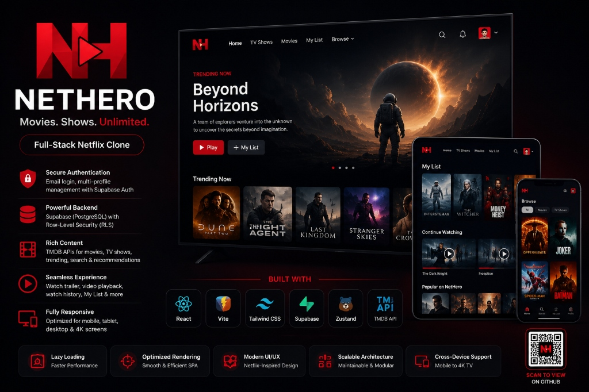

<div align="center">



<br />
<br />

# NetHero

**Netflix-inspired full-stack OTT streaming platform**

[](https://netherolive.netlify.app)
&nbsp;
[](https://react.dev)
[](https://vitejs.dev)
[](https://tailwindcss.com)
[](https://supabase.com)
[](https://www.themoviedb.org)
[](https://netherolive.netlify.app)

</div>

---

## About

NetHero is a production-grade Netflix clone built with **React**, **Vite**, and **Tailwind CSS**, backed by **Supabase** (PostgreSQL + Auth) and the **TMDB API**. It features email authentication, multi-profile support, a personalised My List, watch-history tracking, and a custom full-screen video player — all wrapped in a fully responsive streaming experience that works seamlessly across mobile, tablet, desktop, and 4K screens.

---

## ✨ Features

| Feature | Details |
|---|---|
| 🔐 **Authentication** | Email/password sign-up & login via Supabase Auth |
| 👤 **Multi-Profile** | Create, select, and manage per-account profiles |
| 🎬 **Browse** | Netflix-style billboard hero with auto-playing trailer |
| 🎞️ **Movies & TV Shows** | Dedicated pages with genre filter and row-based grid |
| 🔍 **Search** | Expandable search bar with URL-driven query (`?q=`) and debouncing |
| 📋 **My List** | Add/remove titles with optimistic UI and Supabase persistence |
| ▶️ **Video Player** | Custom full-screen player with controls auto-hide, seek, mute, volume |
| 📺 **Trailers** | YouTube trailers embedded in the billboard and card hover overlay |
| 🃏 **Card Hover** | Floating hover card with trailer preview, ratings, and actions |
| 📄 **Detail Modal** | Full detail modal with cast, genres, and play/My List actions |
| 🕑 **Watch History** | Progress tracked per profile and saved to Supabase every 10 seconds |
| 📱 **Responsive** | Optimised for mobile, tablet, desktop, and 4K TV viewports |
| ⚡ **Performance** | Lazy-loaded rows, skeleton loading states, intersection-observer |

---

## 🛠 Tech Stack

| Layer | Technology |
|---|---|
| **Framework** | [React 18](https://react.dev) |
| **Build Tool** | [Vite 5](https://vitejs.dev) |
| **Styling** | [Tailwind CSS 3](https://tailwindcss.com) |
| **Routing** | [React Router 6](https://reactrouter.com) |
| **State** | [Zustand](https://zustand-demo.pmnd.rs) |
| **Backend / Auth** | [Supabase](https://supabase.com) (PostgreSQL + Row-Level Security) |
| **Content API** | [TMDB API](https://www.themoviedb.org/documentation/api) |
| **HTTP Client** | [Axios](https://axios-http.com) |
| **Animations** | [Framer Motion](https://www.framer.com/motion) |
| **Video** | [React Player](https://github.com/cookpete/react-player) |
| **Icons** | [Lucide React](https://lucide.dev) |
| **Toasts** | [React Hot Toast](https://react-hot-toast.com) |
| **Deployment** | [Netlify](https://netlify.com) |

---

## 🏗 Architecture

```
Browser
    │
React + React Router  ← SPA routing, lazy-loaded pages
    │
Zustand State         ← auth, profile, UI, modal, myList stores
    │
Supabase              ← Auth (email/password) + PostgreSQL (my_list, watch_history)
    │
TMDB API              ← movies, TV shows, trending, search, trailers
```

---

## 📁 Folder Structure

```
nethero/
├── public/
│   ├── favicon.svg
│   ├── logo.svg
│   └── _redirects              # Netlify SPA fallback
├── src/
│   ├── assets/                 # Static images and icons
│   ├── components/
│   │   ├── browse/             # Hero, Row, MovieCard, MovieCardHover
│   │   ├── common/             # Button, Image, Skeleton
│   │   ├── layout/             # Navbar, Footer, MobileMenu, ProfileDropdown
│   │   ├── modal/              # DetailModal
│   │   ├── player/             # VideoPlayer, PlayerControls, PlayerOverlay
│   │   └── search/             # SearchBar, SearchResults
│   ├── constants/              # Routes, genres
│   ├── hooks/                  # useFetch, useMyList, useScroll, useOnClickOutside
│   ├── lib/                    # TMDB client (axios), Supabase client
│   ├── pages/                  # Browse, Movies, TVShows, Search, MyList, Watch, …
│   ├── store/                  # Zustand stores (auth, profile, UI, modal, myList)
│   ├── styles/                 # Global CSS
│   ├── App.jsx
│   ├── main.jsx
│   └── router.jsx
├── .env.example
├── SPEC.md
├── package.json
├── tailwind.config.js
└── vite.config.js
```

---

## ⚙️ Environment Variables

Copy `.env.example` to `.env.local` and fill in your keys:

```env
VITE_TMDB_API_KEY=your_tmdb_v3_key_here
VITE_TMDB_BASE_URL=https://api.themoviedb.org/3
VITE_TMDB_IMG_URL=https://image.tmdb.org/t/p
VITE_SUPABASE_URL=your_supabase_project_url
VITE_SUPABASE_ANON_KEY=your_supabase_anon_key
```

> **TMDB key** — free at [themoviedb.org](https://www.themoviedb.org/settings/api)  
> **Supabase** — free tier at [supabase.com](https://supabase.com)

---

## 🚀 Getting Started

```bash
# 1. Clone the repository
git clone https://github.com/Rashmiranjantandia/nethero.git
cd nethero

# 2. Install dependencies
npm install

# 3. Configure environment
cp .env.example .env.local
# Edit .env.local with your TMDB and Supabase credentials

# 4. Start the development server
npm run dev
```

Open [http://localhost:5173](http://localhost:5173) in your browser.

---

## 🌐 Deployment

NetHero is deployed on **Netlify** with automatic SPA routing via `public/_redirects`:

```
/*    /index.html   200
```

**To deploy your own instance:**

1. Fork this repository
2. Connect to [Netlify](https://netlify.com)
3. Set build command: `npm run build`
4. Set publish directory: `dist`
5. Add environment variables in the Netlify dashboard

---

## 🔭 Future Improvements

- [ ] Continue Watching row on Browse page (history-driven)
- [ ] Episode selector for TV show seasons
- [ ] Offline favourite caching via service worker
- [ ] Push notifications for new releases
- [ ] Admin dashboard for content moderation
- [ ] Accessibility audit and WCAG 2.1 AA compliance pass

---

## 📄 License

This project is licensed under the [MIT License](LICENSE).

---

<div align="center">

Made with ❤️ Rashmi Ranjan · Powered by [TMDB](https://www.themoviedb.org) · Hosted on [Netlify](https://netlify.com)

</div>
